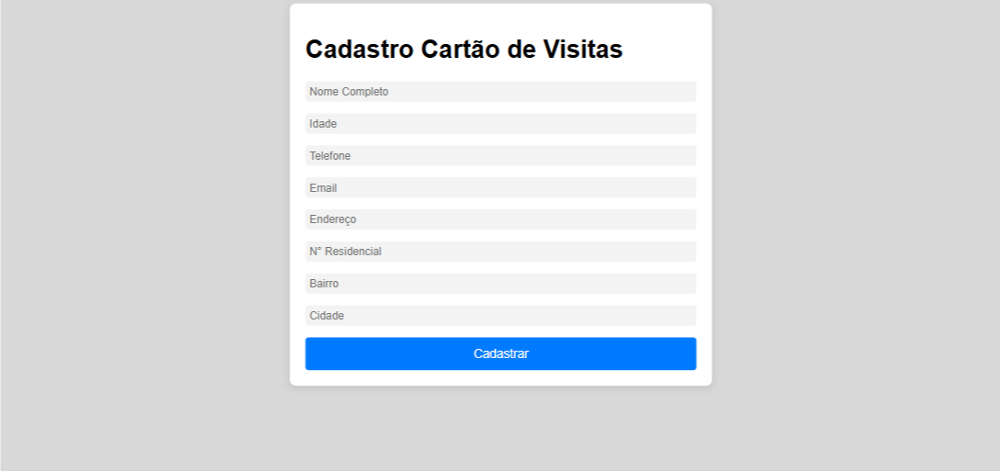
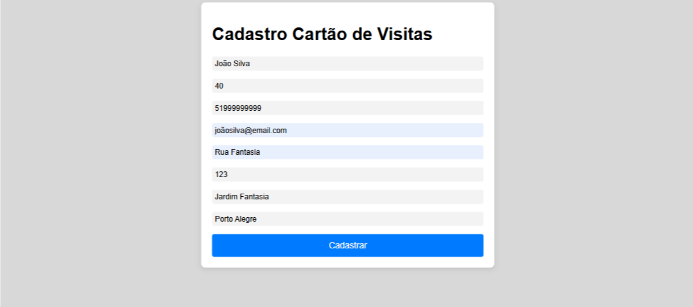
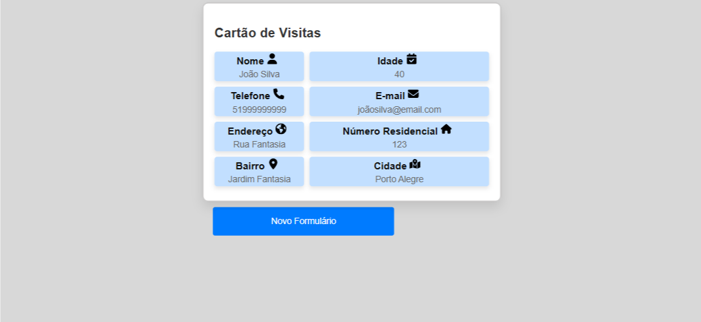

# Formulário de Cadastro




## Descrição 
 Aplicação desenvolvida em Angular com interface de um formulario de cadastro com uma apresentação final de um cartão de visitas com o resultado do preenchimento do formulário!

### Objetivo 

 O formulário tem como objetivo coletar informações essenciais para a criação de um cartão de visitas, como nome, idade, telefone, e-mail, endereço, número residencial, bairro, cidade. Uma vez preenchido, o usuário pode gerar seu cartão de visitas.

## Demostração do Layout  





## Como Utilizar 

1. **Clone o Repositório**

```bash
 git clone ENDEREÇO REPOSITÓRIO
```
2. **Rodar**
- Entrar na pasta raiz utilizando terminal !
```bash
cd PASTA RAIZ

 npm install 

 ng serve
```


## Tecnologias Utilizadas 

1.JavaScript 

2.TypeScript 

3.CSS

4.Angular 

## Autor

[Abreeu](https://www.linkedin.com/in/abreeu/)


## Licença

Este projeto está sob a licença MIT. Você é livre para usá-lo como quiser, tanto para uso pessoal quanto comercial.